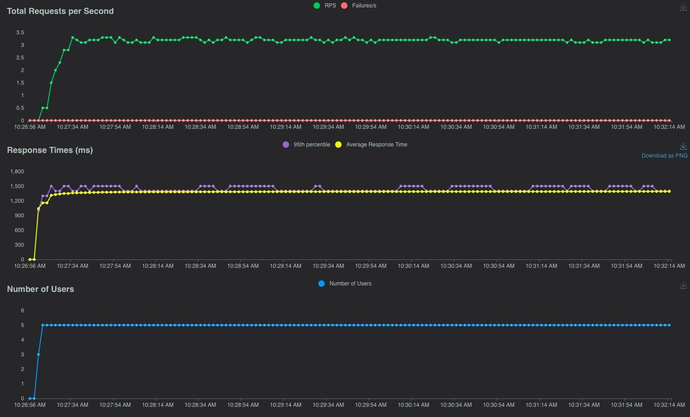
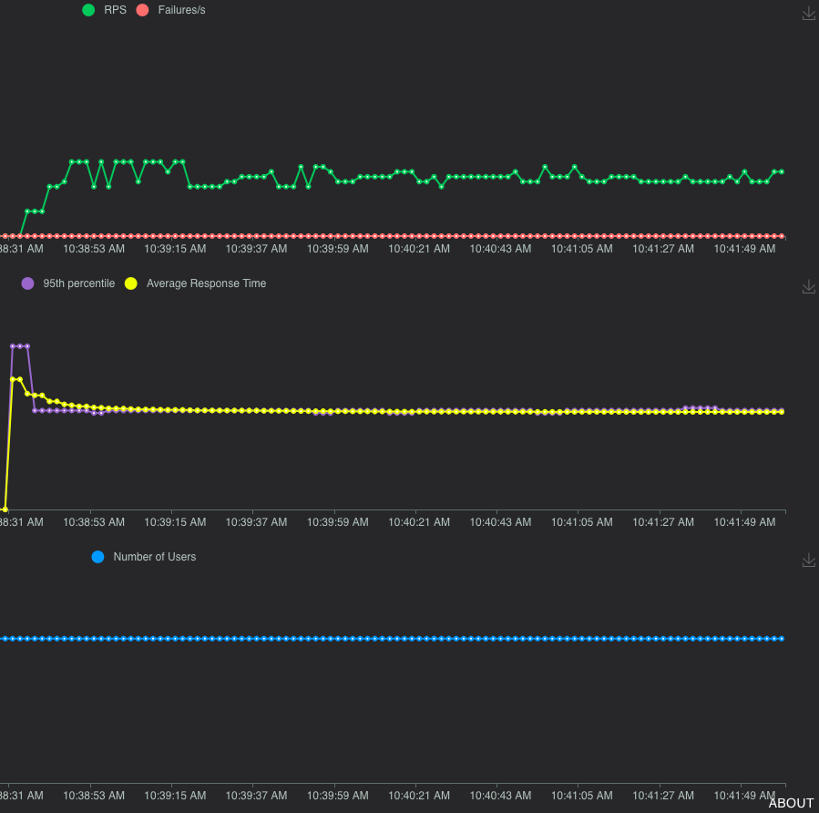
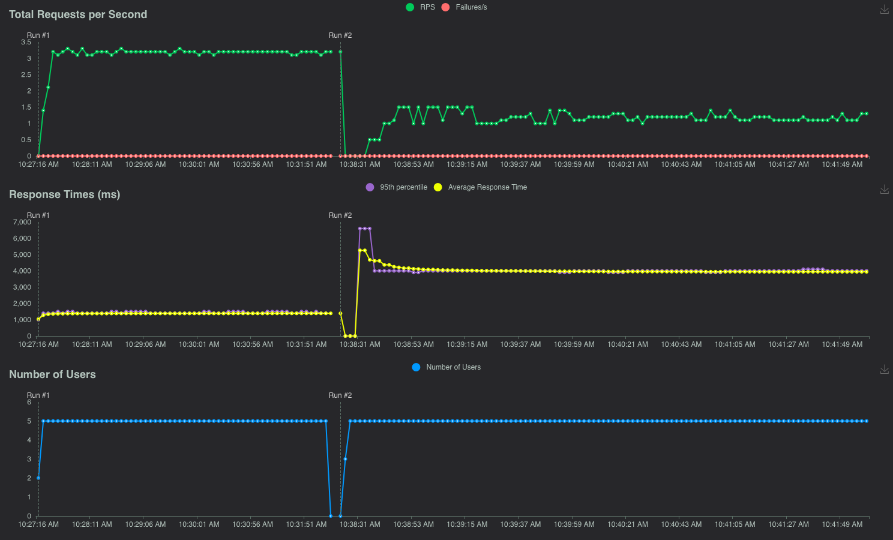

# CIP-02152024: Optimization Actions

## Status

Current Status: `Under Discussion`

## Motivation

Through extensive experimentation we have determined the following to be true:

1. Using frequent `ANALYZE` and `VACUUM` commands on Chroma's sqlite database affirmatively improves the performance of
   the whole system.
2. Periodic WAL cleanup both improves the performance and reduces the storage requirements of the database drastically.
3. Query optimization of complex metadata filtering queries improves performance by a factor of N (where N is the
   average number of metadata fields per record in the database).

We see a significant benefit for Chroma users if we can automate these tasks. This CIP proposes to automation of tasks 1
and 2, while we suggest that task 3 is a separate CIP.

Community issues associated with slow performance:

- https://github.com/chroma-core/chroma/issues/1043
- https://github.com/chroma-core/chroma/issues/1394
- https://github.com/chroma-core/chroma/issues/1755
- https://discord.com/channels/1073293645303795742/1210414333717254144
- https://discord.com/channels/1073293645303795742/1202226062587875438
- https://discord.com/channels/1073293645303795742/1168605029532434444

## Public Interfaces

This CIP proposes the following changes to the public interfaces:

- `client.otimize()` - a new Client method that will trigger optimization for the entire database. It is important to
  keep in mind that this action will be applicable to single-node Chroma.
- New API endpoint - `/api/v1/optimize` - a new API endpoint that will trigger optimization on a remote server.

## Proposed Changes

The changes impact several parts of the system:

- Clients and APIs - the proposed changes will impact - the Python and JavaScript clients, as well as the HTTP API.
- SegmentAPI - We suggest that the implementation is carried out in `chromadb.api.segment.SegmentAPI`.

### Actions

We propose the following optimization actions:

- Clean up the WAL - the change is introduced at `Producer`
- Run `VAUCUM` - Changes introduced at SysDB level
- Run `ANALYZE` - Changes introduced at SysDB level

While the optimize operation is going to be safe to run on a live system, we suggest that users use it on off-peak
hours, as it will impact performance.

### Dry Run

By default, optimize will execute in a dry-run mode, just providing the user with feedback on what it would do (
intuition: Query Planner EXPLAIN). The user can then decide to run the operation with the `dry_run` flag set to `False`.

These are the steps performed by each action in dry-run mode:

- Clean WAL - The operation will provide the user with an estimate how many entries will be purged from the WAL, per
  collection summary of WAL purged. A heuristic will be implemented to provide the user with an estimate of how much
  space will be cleaned up (after VACUUM is also executed)
- VACUUM - The operation will provide the user with an estimate of how much space will be cleaned up. SQLite does not
  provide direct info about used storage, therefore we'll rely on page-related heuristics to provide the user with an
  estimate of how much space will be cleaned up (after VACUUM is also executed)
- ANALYZE - The operation will not provide feedback as SQLIte does not provide utilities to estimate the impacts
  of `ANALYZE`. This operation will not provide feedback on the dry-run mode.

### Data Structures

We propose that the operation takes in the following request object:

```python
class OptimizationRequest(TypedDict):
    dry_run: bool  # defaults to True
    vacuum: bool  # defaults to True
    analyze: bool  # defaults to True
    wal_cleanup: bool  # defaults to True
```

We propose that the `optimize()` operation return a bare minimum stats on what it has achieved. Our initial suggestion
is the following:

```python
class OptimizationStats(TypedDict):
    storage_reduction: float
    wal_entries_purged: int
```

We think that providing meaningful stats is important for users to understand the impact of the optimization.

### Experimentation

This is how the DB looks like after importing 1M records with 2 metadata fields each:

```bash
(venv) % ls -lhatr optimize-test
total 23659040
drwxr-xr-x  54 user  staff   1.7K Feb 15 18:29 ..
drwxr-xr-x@  7 user  staff   224B Feb 15 18:29 6cdc4d45-3977-46ef-8c4b-123c303e0519
-rw-r--r--@  1 user  staff    11G Feb 15 19:07 chroma.sqlite3
drwxr-xr-x@  4 user  staff   128B Feb 15 19:07 .
(venv) % du -h optimize-test/
5.9G    optimize-test/6cdc4d45-3977-46ef-8c4b-123c303e0519
17G    optimize-test/
```

To benchmark a heavy filtering query:

```bash
(venv) sqlite3 optimize-test-noopt/chroma.sqlite3 < query1.sql | tail -1
Run Time: real 10.713 user 6.983000 sys 3.542708
```

Here is how the SQL query looks like for `get()` with `where={"$or":[{"rand":{"$gt": 501}},{"rand":{"$gt": 704}}]}`:

```sql
.timer on
SELECT "embeddings"."id",
       "embeddings"."embedding_id",
       "embeddings"."seq_id",
       "embedding_metadata"."key",
       "embedding_metadata"."string_value",
       "embedding_metadata"."int_value",
       "embedding_metadata"."float_value",
       "embedding_metadata"."bool_value"
FROM "embedding_metadata"
         JOIN "embeddings" ON "embeddings"."id" = "embedding_metadata"."id"
WHERE "embeddings"."segment_id" = '04f48070-bbd4-41ea-9928-77309c20965e'
  AND ("embedding_metadata"."id" IN (SELECT "id"
                                     FROM "embedding_metadata"
                                     WHERE "key" = 'rand'
                                       AND ("int_value" > 501 OR "float_value" > 501)) OR
       "embedding_metadata"."id" IN (SELECT "id"
                                     FROM "embedding_metadata"
                                     WHERE "key" = 'rand'
                                       AND ("int_value" < 704 OR "float_value" < 704)))
ORDER BY "embeddings"."embedding_id";
```

We also examine the WAL:

```bash
(venv) % sqlite3 optimize-test/chroma.sqlite3 'select count(*) from embeddings_queue;'
1000000
```

Now let's run the optimization:

```python
import chromadb

client = chromadb.PersistentClient("optimize-test")
client.optimize()
```

We have the following results:

```bash
(venv) % ls -lhatr optimize-test
total 4051464
drwxr-xr-x@  7 user  staff   224B Feb 15 18:29 6cdc4d45-3977-46ef-8c4b-123c303e0519
drwxr-xr-x@  4 user  staff   128B Feb 15 19:14 .
-rw-r--r--@  1 user  staff   1.9G Feb 15 19:14 chroma.sqlite3
drwxr-xr-x  54 user  staff   1.7K Feb 15 19:14 ..
(venv) % du -h optimize-test/
5.9G    optimize-test/6cdc4d45-3977-46ef-8c4b-123c303e0519
7.9G    optimize-test/
(venv) % sqlite3 optimize-test/chroma.sqlite3 'select count(*) from embeddings_queue;'
1
(venv) sqlite3 optimize-test/chroma.sqlite3 < query1.sql | tail -1
Run Time: real 12.374 user 5.573911 sys 1.288665
```

The optimize command has achieved the following:

- Reduced the size of the database by about 9GB (by cleaning up the WAL from 1M documents with 1536 dim embeddings)
- Optimized Query planning and execution which is visible by the lower user and sys times in the query execution.

> Note: It is worth pointing out that the overall query time has increased, but that is inconsequential as we'll
> demonstrate in the query benchmarking section.

#### Side Note about WAL Cleanup

The underlying SQL schema does not have a auto-increment on the WAL table (`embeddings_queue`) key (`seq_id`) therefore
we cannot a complete cleanup of the WAL is not possible. The reason for that is once we remove all entries (e.g. when
the number of WAL entries aligns with the sync threshold of the vector index), subsequent insertions will begin from the
lowest key which will be 1. The result of the latter is that none of the newly inserted entries make it to either the
Metadata or the Vector indices as their max_seq_id will be higher than the newly inserted entries.

We intend to fix that by introducing an auto-increment on the `seq_id` key in the WAL table in a separate PR.

### Query Benchmarking

We'll use Locust to benchmark the actual implications of optimizing your databases.

We will benchmark the above wost-case query with range filter, which historically tends to be the slowest query.

In our locust setup we will `get()` from the database for a random vector which we will use to query with the range
filter.

Our locust test will run for 5m to ensure any jitter in the results is minimized.

**Optimized database:**




**Non-optimized database:**




**Side-by-Side Comparison:**



Our observations are that the proposed optimization has a drastic impact on the performance of Chroma. It is important
to note that for this benchmark we are using a single workload with get/query semantics and more investigations are
needed to understand the impact on other workloads (e.g. add/update/delete).

> Note: All tests were run on an 2023 M3 Max. Results on other systems may vary, but should follow the same trend.

## Compatibility, Deprecation, and Migration Plan

The change is backward compatible. Newer clients will not work with older APIs, but older clients will work with the new
Chroma version.

## Test Plan

- API tests

## Rejected Alternatives

TBD.
