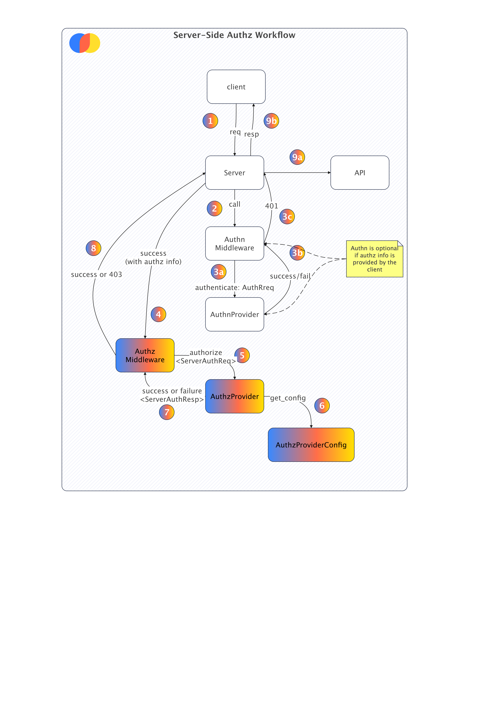

# CIP-10112023: Authorization

## Status

Current Status: `Draft`

## **Motivation**

The motivation for introducing an authorization feature in Chroma is to address the lack of a proper authorization model that many users are struggling with, especially those who deploy production apps. Additionally, as Chroma is gearing up for production-grade deployments out of the box, it is essential to have a proper authorization model in place for distributed and hosted Chroma instances.

## **Public Interfaces**

No changes to public interfaces are proposed in this CIP.

## **Proposed Changes**

In this CIP we propose the introduction of abstractions necessary for implementing a multi-user authorization scheme in a pluggable way. We also propose a baseline implementation of such a scheme which will be shipped with Chroma as a default authorization provider.

It is important to keep in mind that the client/server interaction in Chroma is meant to be stateless, as such the Authorization approach must also follow the same principle. This means that the server must not store any state about the user's authorization. The authorization decision must be made on a per-request basis.

The diagram below illustrates the levels of abstractions we introduce:



In the above diagram we highlight the new abstractions we introduce in this CIP and we also demonstrate the interop with the existing Authentication

### Concepts

#### ServerAuthorizationProvider

The `ServerAuthorizationProvider` is a class that abstracts a provider that will authorize requests to the Chroma server (FastAPI). In practical terms the provider will integrate with an external authorization service (e.g. Auth0, Okta, Permit.io etc.) and will be responsible for allowing or denying the user request.

In our baseline implementation we will provide a simple file-based authorization provider that will read authorization configuration from a YAML file.

#### ServerAuthzConfigurationProvider

The `ServerAuthzConfigurationProvider` is a class that abstracts a the configuration needed for authorization provider to work. In practice that implies, reading secrets from environment variables, reading configuration from a file, or reading configuration from a database or secrets file, or even KMS.

In our baseline implementation the AuthzConfigurationProvider will read configuration from a YAML file.

#### ServerAuthorizationRequest

The `ServerAuthorizationRequest` encapsulates the authorization context.

#### ServerAuthorizationResponse

Authorization response provides authorization provider evaluation response. It returns a boolean response indicating whether the request is allowed or denied.

#### ChromaAuthzMiddleware

The `ChromaAuthzMiddleware` is an abstraction for the server-side middleware. At the time of writing we only support FastAPI. The  middleware interface supports several methods:

- `authorize` - authorizes the request against the authorization provider.
- `ignore_operation` - determines whether or not the operation should be ignored by the middleware
- `instrument_server` - an optional method for additional server instrumentation. For example, header injection.

#### AuthorizationError

Error thrown when an authorization request is disallowed/denied by the authorization provider. Depending on authorization provider's implementation such error may also be thrown when the authorization provider is not available or an internal error ocurred.

Client semantics of this error is a 403 Unauthorized error being returned over HTTP interface.

#### AuthorizationContext

The AuthorizationContext provides the necessary information to the authorization provider to make a decision whether to allow or deny the request. The context contains the following information:

```json
{
"user": {"id": "API Token or User Id"},
"resource": {"namespace": "database", "id": "collection_id"},
"action": {"id":"get_or_create"},
}
```

We intentionally want to keep this as minimal as possible to avoid any unnecessary complexity and to allow users to easily understand the authorization model. However the context is just an abstraction of the above representation and each authorization provider will need to implement the above and if necessary extend it to support additional information.

We propose the following classes to represent the above:

```python
from typing import TypeVar, Generic

# Below three classes are from Chroma's baseline AuthZ implementation
class User:
    id: Optional[str]

class Resource:
    id: str
    namespace: Optional[str]

class Action:
    id: str

TUser = TypeVar("TUser")
TResource = TypeVar("TResource")
TAction = TypeVar("TAction")

class AbstractAuthZContext(Generic[TUser, TResource, TAction]):
    user: TUser
    resource: TResource
    action: TAction

# Example of a concrete implementation from Chroma's baseline AuthZ implementation

class SimpleAuthZContext(AbstractAuthZContext[User, Resource, Action]):
    pass
```

### Baseline Implementation

In this section we propose a minimal implementation example of the authorization framework which will also ship in Chroma as a default authorization provider and a reference implementation. Our reference implementation relies on static configuration files in YAML format.

#### Authentication and Authorization Config Scheme

```yaml
users:
    - id: user@example.com
      tokens:
        - my_api_token
actions:
    - list_collections
    - get_collection
    - create_collection
    - get_or_create_collection
    - delete_collection
    - update_collection
    - add
    - delete
    - get
    - query
    - peek
    - update
    - upsert

```

## **Compatibility, Deprecation, and Migration Plan**

This CIP is not backwards for Chroma clients.

## **Test Plan**

Property and Integration tests.

## **Rejected Alternatives**

TBD

## **References**
